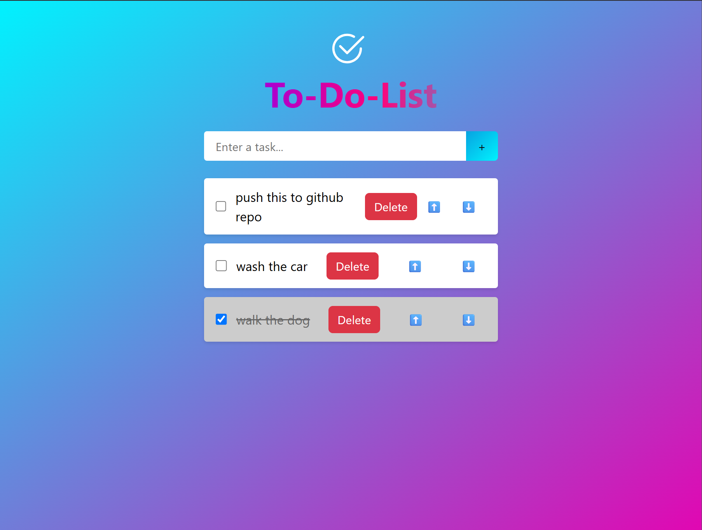

# ✅ To-Do List Web App

A beautifully designed, responsive To-Do List application built with a focus on clean UI/UX and user-friendly task management.



## ✨ Features

- 🎨 **Modern UI**: Stunning gradient background with vibrant, colorful elements.
- ➕ **Add Tasks**: Input field with an intuitive '+' button to add new tasks.
- ✅ **Mark as Done**: Checkboxes strike through completed tasks with a clean animation.
- 🗑️ **Delete Tasks**: Instantly remove tasks using the red delete button.
- 🔼🔽 **Move Tasks**: Reorder tasks with up and down arrows.
- 📦 **Persistent Storage** : integrated with `localStorage` or a backend.

## 🛠️ Tech Stack

- **Frontend**: HTML, CSS (custom gradients & styling),React.js
- **Framework**: React js

## 📸 Preview


> *"Simple to use. Beautiful to see. Efficient to manage."*

## 🚀 Getting Started

To run the project locally:

1. Clone the repository:
   ```bash
   git clone https://github.com/your-username/todo-list-app.git
   cd todo-list-app


# React + Vite

This template provides a minimal setup to get React working in Vite with HMR and some ESLint rules.

Currently, two official plugins are available:

- [@vitejs/plugin-react](https://github.com/vitejs/vite-plugin-react/blob/main/packages/plugin-react) uses [Babel](https://babeljs.io/) for Fast Refresh
- [@vitejs/plugin-react-swc](https://github.com/vitejs/vite-plugin-react/blob/main/packages/plugin-react-swc) uses [SWC](https://swc.rs/) for Fast Refresh

## Expanding the ESLint configuration

If you are developing a production application, we recommend using TypeScript with type-aware lint rules enabled. Check out the [TS template](https://github.com/vitejs/vite/tree/main/packages/create-vite/template-react-ts) for information on how to integrate TypeScript and [`typescript-eslint`](https://typescript-eslint.io) in your project.
